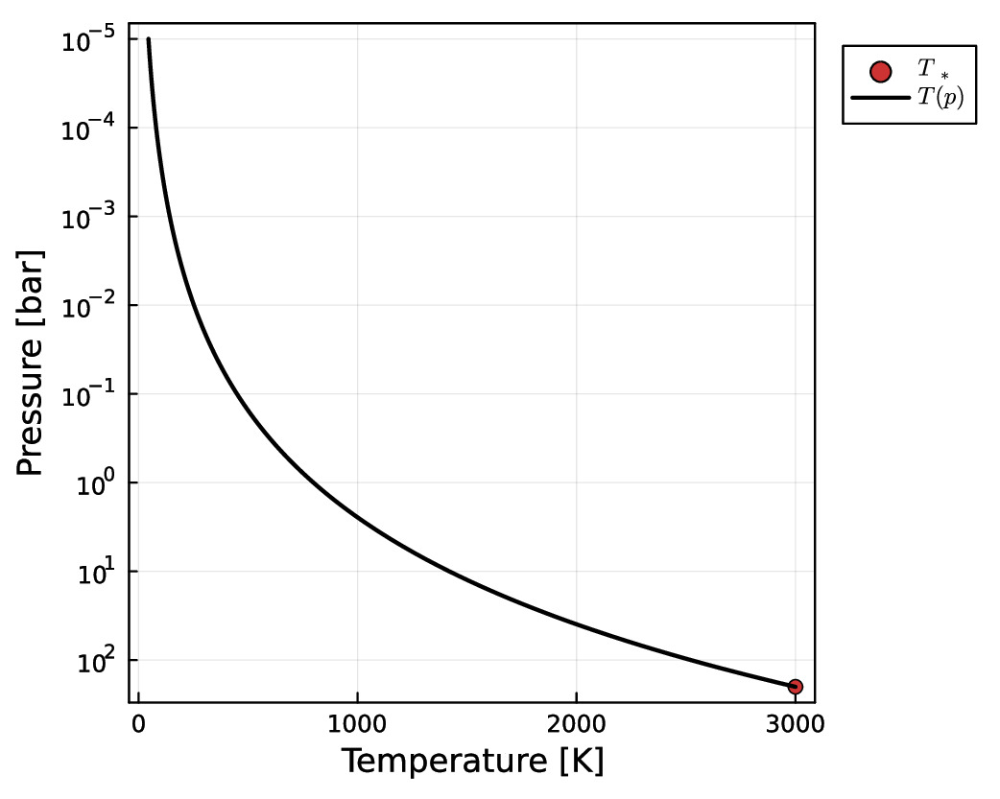
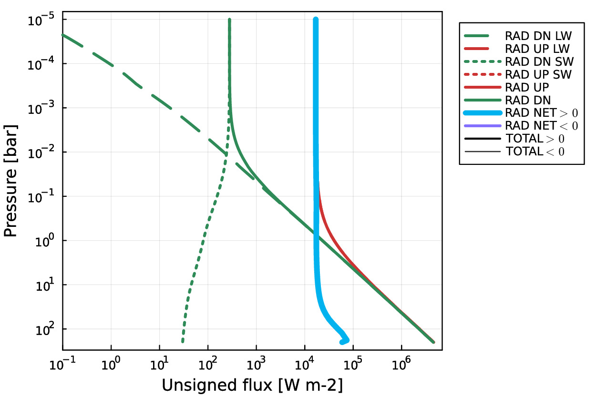
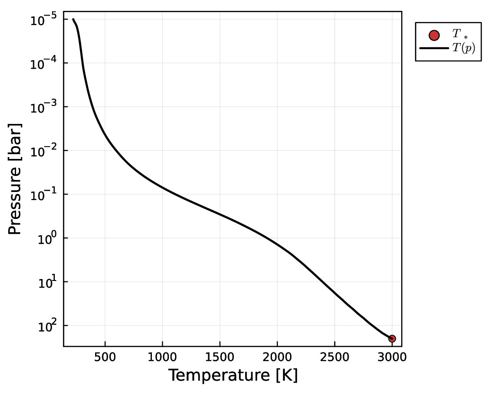
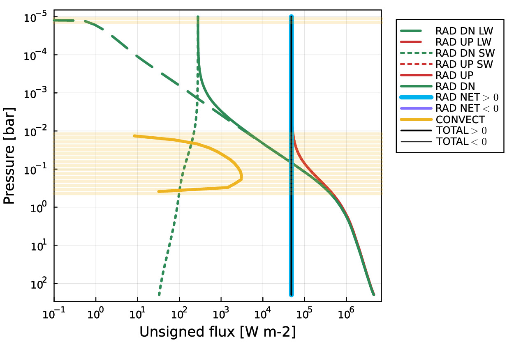

# AGNI
Radiative-convective solver designed for integration into a coupled atmosphere-interior code.   

AGNI relies on SOCRATES (2306) for calculating radiances. It makes use of the Julia interface to SOCRATES as written by Stuart Daines [(see their branch here)](https://code.metoffice.gov.uk/trac/socrates/browser/main/branches/dev/stuartdaines/r1126_julia_interface). The radiative transfer includes shortwave irradiation from the star, surface emission, gaseous absorption, Rayleigh scattering, and continuum absorption / CIA.        

Surface boundary conditions are intended to be set by an interior model, so AGNI won't work as well for cooler planets. The model also includes a parameterised conductive 'skin' with a prescribed thickness and conductivity, allowing the surface temperature to be calculated according to the required conductive flux. Two convection parameterisations are included: convective adjustment (directly manipulating the temperature arrays), and mixing length theory (calculating convective energy fluxes). Results are optionally plotted (and animated), and may be saved as NetCDF or CSV files. The model first uses a multistep Adams-Bashforth integrator which integrates the heating rates at each level until fluxes are roughly balanced; this state then provides the initial guess for a Newton-Raphson-Backtracking method which achieves strict flux continuity.
    
Pronounced: *ag-nee*. Named after the fire deity of Hinduism.      

### Repository structure 
* `README.md`       - This file
* `LICENSE.txt`     - License for use and re-use
* `doc/`            - Other documentation
* `out/`            - Output files
* `res/`            - Resources
* `src/`            - AGNI source code
* `socrates/`       - Directory containing SOCRATES and associated files (subject to the license therein)
* `agni.jl`         - AGNI executable for debugging
* `agni_cli.jl`     - AGNI executable with command-line interface
* `demo_steamrun.jl`- Script to demonstrate the pure-steam runaway greenhouse effect
* `demo_earth.jl`   - Script to demonstrate solving for Earth's temperature structure
* `demo_hotdry.jl`  - Script to demonstrate solving for a hot and dry post-runaway steam atmosphere
* `demo_tests.jl`   - Script containing quick tests for verifying that the basics of the model are functioning

### Requirements
* Julia (version 1.9.1 or later)
* Python (version 3.10 or later)
* NumPy and SciPy
* gfortran (NB: do not use ifort or aocc)
* netcdf-fortran
* make
* OpenMP

### Supported platforms
* MacOS (ARM and x86-64)
* Ubuntu (x86-64)

### Installation instructions
- `$ cd socrates`
- `$ cp ../res/Mk_cmd_PLAT ./make/Mk_cmd` where PLAT is your platform
- `$ ./build_code`
- `$ source set_rad_env`
- `$ cd julia`
- `$ julia`
- `julia> ]`
- `(@v1.9) pkg> add OffsetArrays`
-  `(@v1.9) pkg> add Revise`
-  `(@v1.9) pkg> add PCHIPInterpolation`
-  `(@v1.9) pkg> add LaTeXStrings`
-  `(@v1.9) pkg> add Plots`
-  `(@v1.9) pkg> add NCDatasets`
-  `(@v1.9) pkg> add DataStructures`
-  `(@v1.9) pkg> add Glob`
-  `(@v1.9) pkg> add ArgParse`
-  `(@v1.9) pkg> add NLsolve`
-  `(@v1.9) pkg> add LineSearches`
-  `(@v1.9) pkg> activate .`
-  Press backspace
-  `julia> cd("src")`
-  `julia> include("generate_wrappers.jl")`
-  `julia> exit()`
-  `$ cd lib`
-  `$ make`
-  `$ cd ../../..`   
You should end up in the root directory of the repository.    

### Running the code
For the command line interface, run `$ ./agni_cli.jl` (pass `--help` for help).     
To debug the program, run `$ ./agni.jl` in the root directory of the repository.       
To demo the steam runaway greenhouse effect, run `$ ./demo_steamrun.jl`.     

### Example outputs
Pure steam runaway greenhouse (OLR versus surface temperature).

  

Prescribed dry adiabat with a calculation of radiative flux.

  
   

Solution at RCE with radiative and convective fluxes (using MLT).

  
   

