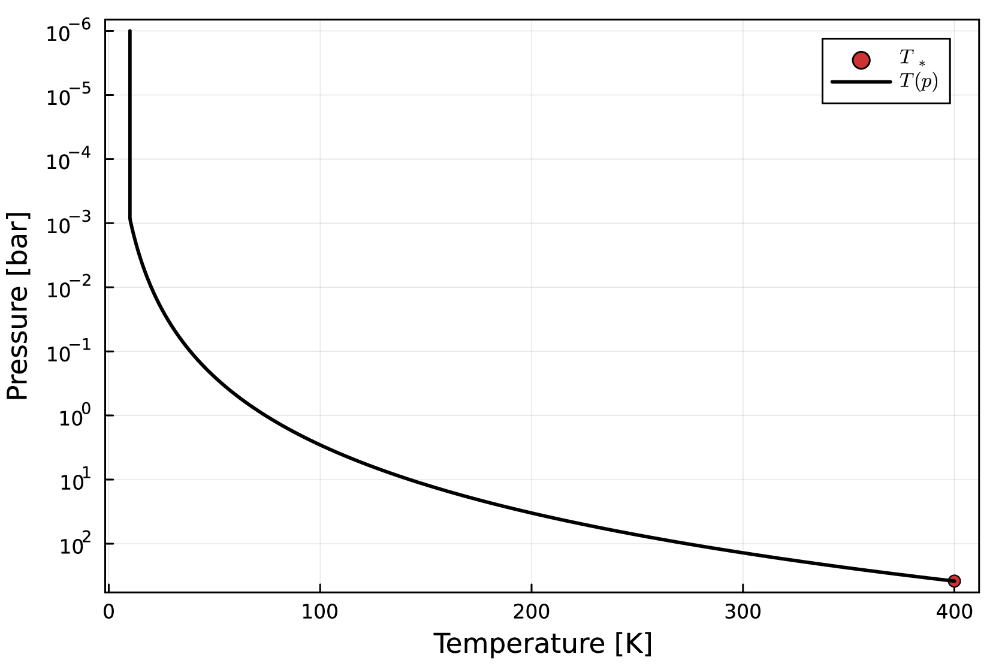
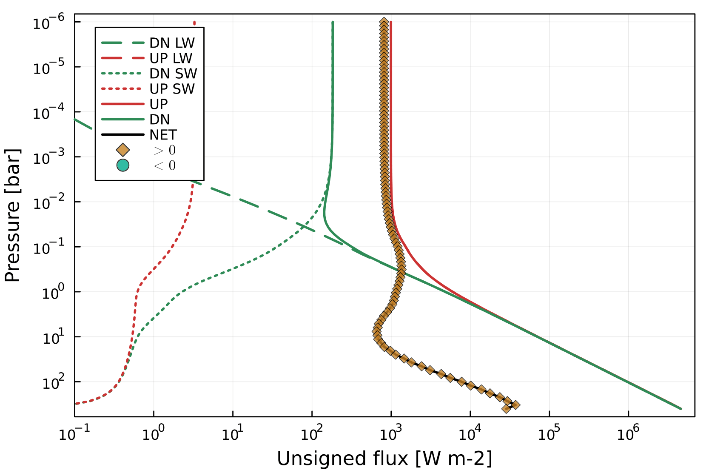
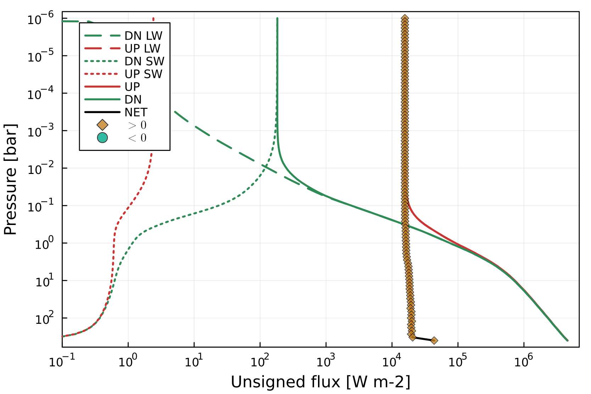

# AGNI
Radiative-convective solver which uses SOCRATES (2306) for radiative-transfer.    
Pronounced: *ag-nee*. Named after the fire deity of Hinduism.    
The main repository for this code is [github.com/nichollsh/AGNI](https://github.com/nichollsh/AGNI).

### Repository structure 
* `README.md`       - This file
* `LICENSE.txt`     - License for use and re-use
* `doc/`            - Other documentation
* `out/`            - Output files
* `res/`            - Resources
* `src/`            - AGNI source code
* `socrates/`       - Directory containing SOCRATES and associated files
* `agni.jl`         - Main AGNI executable 
* `agni_cli.jl`     - CLI AGNI executable
* `demo_steamrun.jl`- Demo pure-steam runaway greenhouse effect

### Requirements
* Julia (version 1.9.1 or later)
* Python (version 3.10 or later)
* NumPy and SciPy
* gfortran
* NetCDF
* netcdf-fortran
* OpenMP

### Supported platforms
* MacOS (ARM and x86-64)
* Ubuntu (x86-64)

### Installation instructions
- `$ cd socrates`
- `$ cp ../res/Mk_cmd_PLAT ./make/Mk_cmd` where PLAT is your platform
- `$ ./build_code`
- `$ cd julia`
- `$ julia`
- `julia> ]`
- `(@v1.9) pkg> add OffsetArrays`
-  `(@v1.9) pkg> add Revise`
-  `(@v1.9) pkg> add PCHIPInterpolation`
-  `(@v1.9) pkg> add LaTeXStrings`
-  `(@v1.9) pkg> add Plots`
-  `(@v1.9) pkg> add Glob`
-  `(@v1.9) pkg> add ArgParse`
-  `(@v1.9) pkg> activate .`
-  Press backspace
-  `julia> cd("src")`
-  `julia> include("generate_wrappers.jl")`
-  `julia> exit()`
-  `$ cd lib`
-  `$ make`
-  `$ cd ../../..`   
You should end up in the root directory of the repository.    

### Running the code
Simply run `$ ./agni.jl` in the root directory of the repository.     
For the command line interface, instead run `$ ./agni_cli.jl` (pass `--help` for help).   
To demo the steam runaway greenhouse effect, run `$ ./demo_steamrun.jl`.   

### Example outputs
Calculating fluxes with SOCRATES, without solving for RCE.

  
   

Solving for RCE with accelerated time-stepping.

  <video src='doc/example_withsolve/anim.mp4' width="400" ></video>
   

### License
See [LICENSE.txt](LICENSE.txt) for AGNI.      
See [socrates/COPYRIGHT.txt](socrates/COPYRIGHT.txt) for SOCRATES.   

