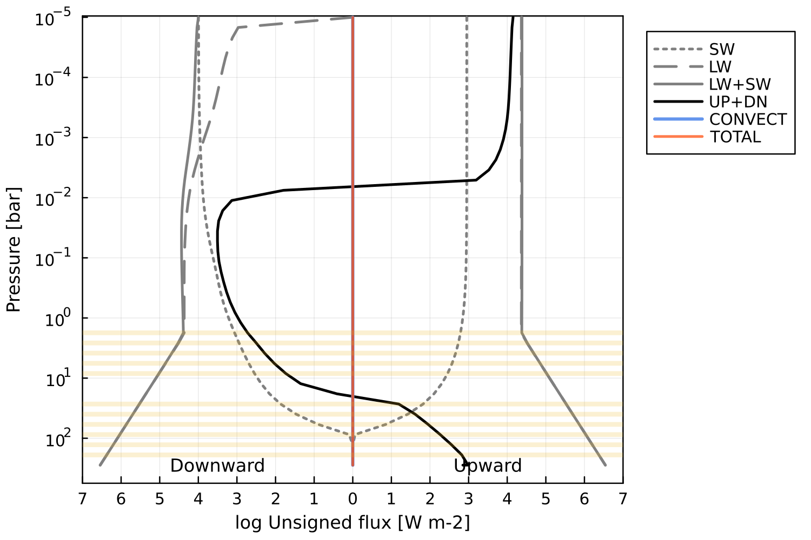

# AGNI
Radiative-convective solver which uses SOCRATES (2306) for radiative-transfer.    
Flux boundary conditions are kept constant, with the upward LW flux being set by `tstar` and the downward SW flux being set by `toa_heating`. The model is designed for integration into a coupled atmosphere-interior code, with surface boundary conditions set by an interior model, so it won't work well for cooler planets.    
    
Pronounced: *ag-nee*. Named after the fire deity of Hinduism.      

### Repository structure 
* `README.md`       - This file
* `LICENSE.txt`     - License for use and re-use
* `doc/`            - Other documentation
* `out/`            - Output files
* `res/`            - Resources
* `src/`            - AGNI source code
* `socrates/`       - Directory containing SOCRATES and associated files
* `socrates/`       - Directory containing SOCRATES and associated files
* `agni.jl`         - AGNI executable for debugging
* `agni_cli.jl`     - AGNI executable with CLI
* `demo_steamrun.jl`- Demonstrate pure-steam runaway greenhouse effect

### Requirements
* Julia (version 1.9.1 or later)
* Python (version 3.10 or later)
* NumPy and SciPy
* gfortran
* netcdf-fortran
* make
* OpenMP

### Supported platforms
* MacOS (ARM and x86-64)
* Ubuntu (x86-64)

### Installation instructions
- `$ cd socrates`
- `$ cp ../res/Mk_cmd_PLAT ./make/Mk_cmd` where PLAT is your platform
- `$ ./build_code`
- `$ cd julia`
- `$ julia`
- `julia> ]`
- `(@v1.9) pkg> add OffsetArrays`
-  `(@v1.9) pkg> add Revise`
-  `(@v1.9) pkg> add PCHIPInterpolation`
-  `(@v1.9) pkg> add LaTeXStrings`
-  `(@v1.9) pkg> add Plots`
-  `(@v1.9) pkg> add NCDatasets`
-  `(@v1.9) pkg> add DataStructures`
-  `(@v1.9) pkg> add Glob`
-  `(@v1.9) pkg> add ArgParse`
-  `(@v1.9) pkg> activate .`
-  Press backspace
-  `julia> cd("src")`
-  `julia> include("generate_wrappers.jl")`
-  `julia> exit()`
-  `$ cd lib`
-  `$ make`
-  `$ cd ../../..`   
You should end up in the root directory of the repository.    

### Running the code
For the command line interface, run `$ ./agni_cli.jl` (pass `--help` for help).     
To debug the program, run `$ ./agni.jl` in the root directory of the repository.       
To demo the steam runaway greenhouse effect, run `$ ./demo_steamrun.jl`.     

### Example outputs
Pure steam runaway greenhouse

  

Calculating fluxes with SOCRATES, without solving for RCE.

  
   

Solving for RCE with accelerated time-stepping.

  
   

