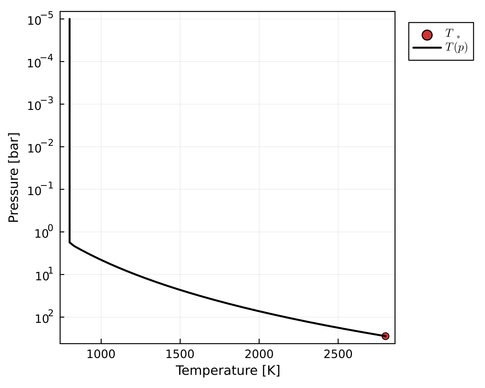
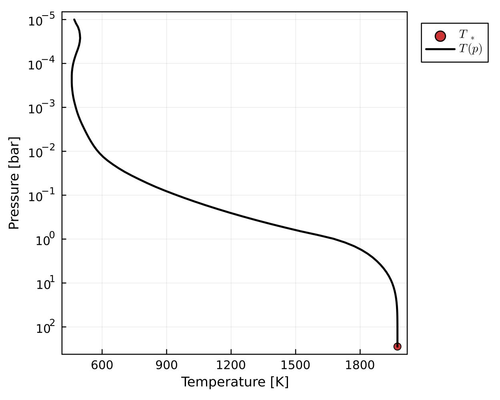

# AGNI
Time-stepped radiative-convective solver designed for integration into a coupled atmosphere-interior code.   

AGNI relies on SOCRATES (2306) for calculating the radiative-transfer. It makes use of the Julia interface to SOCRATES as written by Stuart Daines [(see their branch here)](https://code.metoffice.gov.uk/trac/socrates/browser/main/branches/dev/stuartdaines/r1126_julia_interface). SOCRATES is setup here to include shortwave irradiation from the star, Rayleigh scattering, and continuum absorption / CIA.        

Surface boundary conditions are intended to be set by an interior model, so AGNI won't work as well for cooler planets. The model also includes a parameterised conductive 'skin' with a prescribed thickness and conductivity, allowing the surface temperature to be calculated according to the required conductive flux. Results are optionally plotted (and animated), and may be saved as NetCDF or CSV files.
    
Pronounced: *ag-nee*. Named after the fire deity of Hinduism.      

### Repository structure 
* `README.md`       - This file
* `LICENSE.txt`     - License for use and re-use
* `doc/`            - Other documentation
* `out/`            - Output files
* `res/`            - Resources
* `src/`            - AGNI source code
* `socrates/`       - Directory containing SOCRATES and associated files (subject to the license therein)
* `agni.jl`         - AGNI executable for debugging
* `agni_cli.jl`     - AGNI executable with command-line interface
* `demo_steamrun.jl`- Script to demonstrate the pure-steam runaway greenhouse effect
* `demo_earth.jl`   - Script to demonstrate solving for Earth's temperature structure

### Requirements
* Julia (version 1.9.1 or later)
* Python (version 3.10 or later)
* NumPy and SciPy
* gfortran
* netcdf-fortran
* make
* OpenMP

### Supported platforms
* MacOS (ARM and x86-64)
* Ubuntu (x86-64)

### Installation instructions
- `$ cd socrates`
- `$ cp ../res/Mk_cmd_PLAT ./make/Mk_cmd` where PLAT is your platform
- `$ ./build_code`
- `$ source set_rad_env`
- `$ cd julia`
- `$ julia`
- `julia> ]`
- `(@v1.9) pkg> add OffsetArrays`
-  `(@v1.9) pkg> add Revise`
-  `(@v1.9) pkg> add PCHIPInterpolation`
-  `(@v1.9) pkg> add LaTeXStrings`
-  `(@v1.9) pkg> add Plots`
-  `(@v1.9) pkg> add NCDatasets`
-  `(@v1.9) pkg> add DataStructures`
-  `(@v1.9) pkg> add Glob`
-  `(@v1.9) pkg> add ArgParse`
-  `(@v1.9) pkg> activate .`
-  Press backspace
-  `julia> cd("src")`
-  `julia> include("generate_wrappers.jl")`
-  `julia> exit()`
-  `$ cd lib`
-  `$ make`
-  `$ cd ../../..`   
You should end up in the root directory of the repository.    

### Running the code
For the command line interface, run `$ ./agni_cli.jl` (pass `--help` for help).     
To debug the program, run `$ ./agni.jl` in the root directory of the repository.       
To demo the steam runaway greenhouse effect, run `$ ./demo_steamrun.jl`.     

### Example outputs
Pure steam runaway greenhouse.

  

Calculating fluxes with SOCRATES, without solving for RCE.

  
   

Solving for RCE with accelerated time-stepping.

  
   

An attempt at solving for Earth's temperature profile. The ~100 K accuracy here wouldn't be good enough for Earth system modelling, but it's probably good enough for magma ocean modelling.

  

