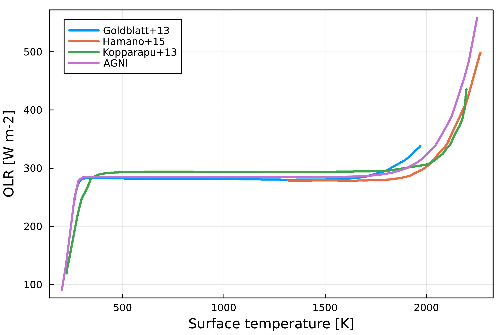
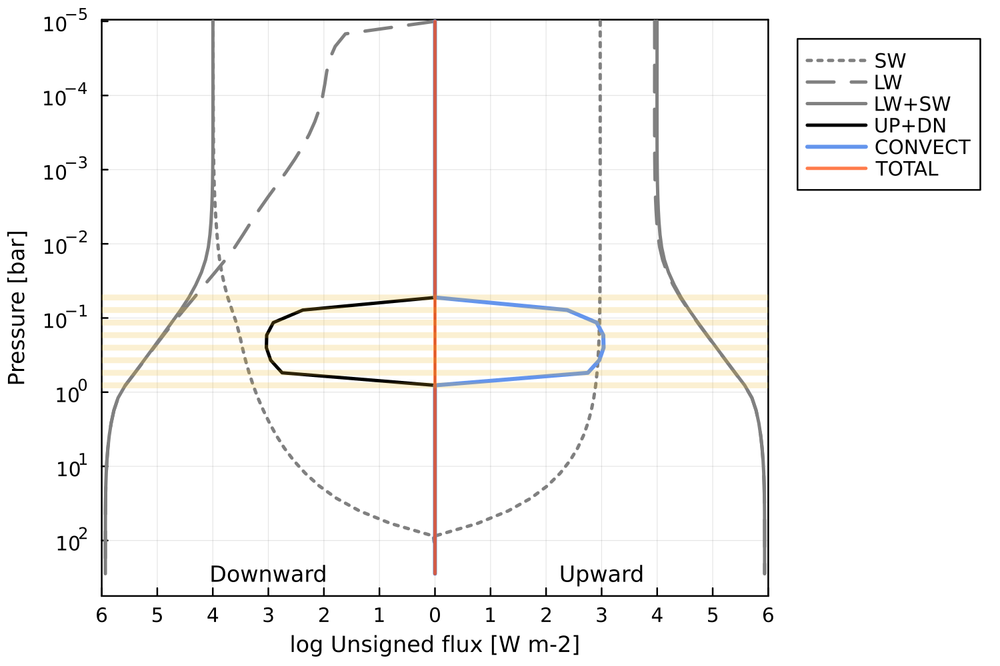

# Example outputs

## Pure steam runaway greenhouse effect
By assuming the atmosphere temperature profile follows a dry adiabat from the surface and then water vapour-condensate coexistance curve defined by the Clausius-Claperyron relation at lower pressures, we see a characteristic relationship between OLR and the surface temperature ($T_s$). Initially OLR increases with $T_s$, but as the condensing layer (which is independent of $T_s$) starts to dominate the photosphere,  OLR and $T_s$ decouple. Eventually the atmosphere reaches a dry post-runaway state, and OLR increases rapidly with $T_s$ once more.
```@raw html
  
```

## Prescribed dry adiabat
In this case, radiative fluxes (right) are calculated according to a temperature profile (left), which follows a dry adiabat from the surface to the top of the atmosphere. Because the temperature profile is entirely prescribed, the fluxes are not balanced locally or globally across the column.
```@raw html
   
   
```

## Radiative-convective solution
The temperature profile (left) is solved such that energy is globally and locally conserved (see fluxes, right). Convection is parameterised using mixing length theory in this case, allowing the system to be solved using a Newton-Raphson method. 
```@raw html
   
   
```

We can then plot the outgoing emission spectrum (left) and normalised contribution function (right). The spectrum clearly demonstrates complex water absorption features, but reproduces blackbody emission at longer wavelengths. The normalised contribution function quantifies how much each pressure level contributes to the outgoing emission spectrum at a given wavelength; this is then plotted versus wavelength and pressure. 

