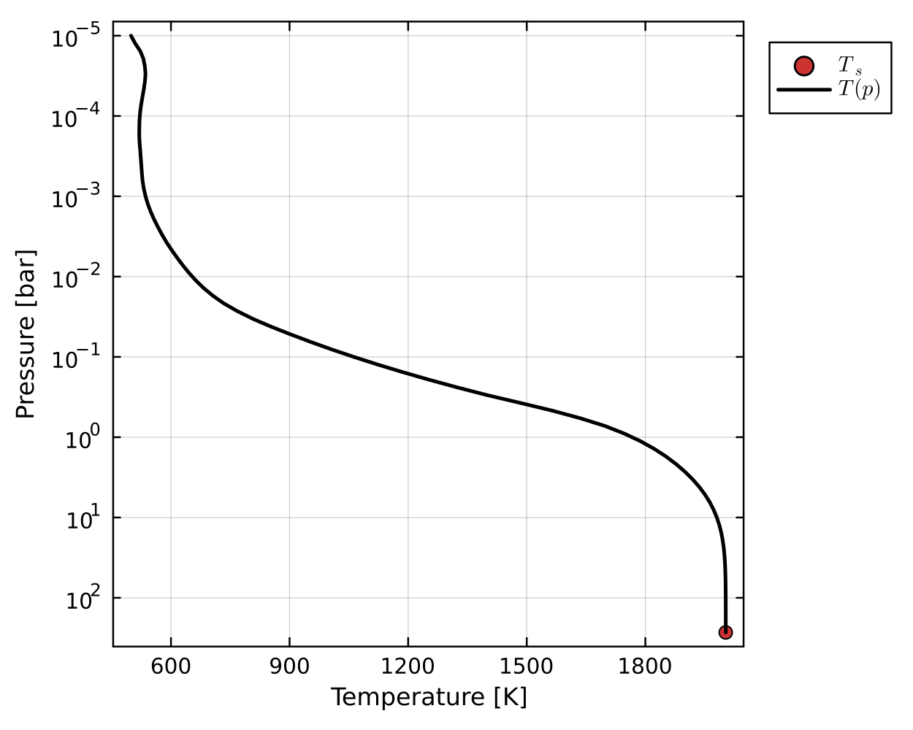
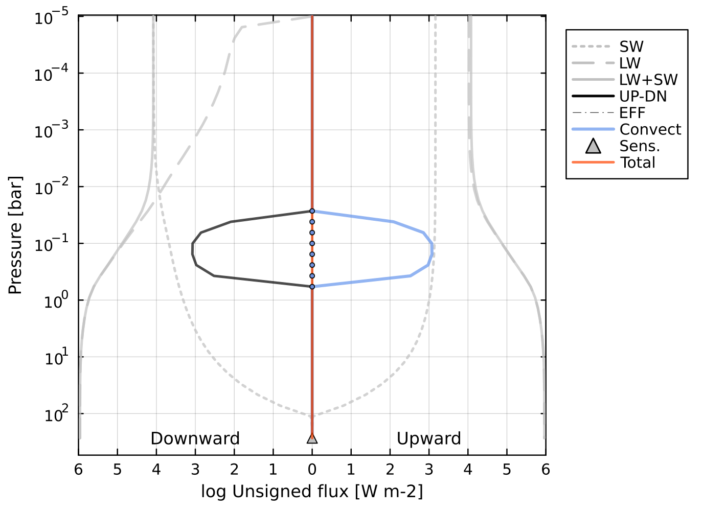
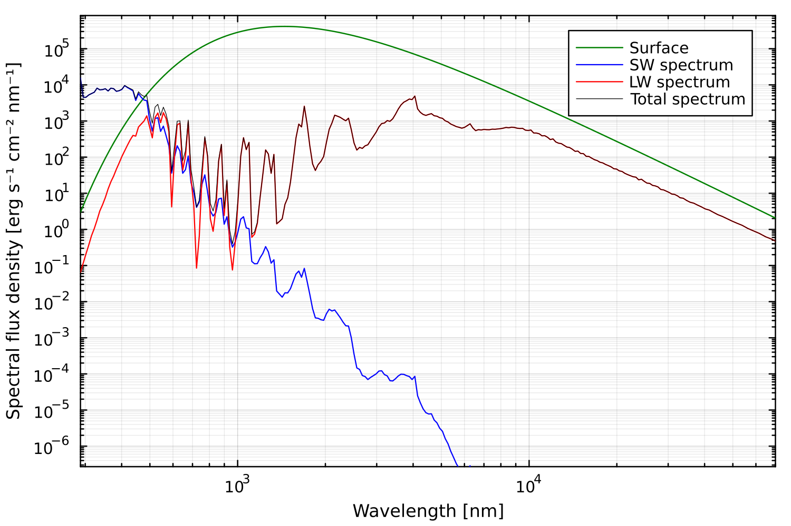

# Example outputs

## Pure steam runaway greenhouse effect
By assuming the atmosphere temperature profile follows a dry adiabat and the water vapour-condensate coexistance curve defined by the Clausius-Claperyron relation, we see a characteristic relationship between the outgoing longwave radiation (OLR) and the surface temperature ($T_s$). Initially OLR increases with $T_s$, but as the condensing layer (which is independent of $T_s$) overlaps with the photosphere, OLR and $T_s$ decouple. Eventually the atmosphere reaches a dry post-runaway state, and OLR increases rapidly with $T_s$.
```@raw html
  
```
You can find a Jupyter notebook which reproduces this result in the [tutorials directory](https://github.com/nichollsh/AGNI/tree/main/tutorials) of the repository.

## Prescribed convective case
In this case, a temperature profile is prescribed to follow a dry adiabat from the surface to a moist region, and then a pseudoadiabat to the top of the atmosphere. This is in line with previous works and the OLR curve above.
```@raw html
  
```
Radiative fluxes are then calculated according to this  temperature profile. Because the profile is prescribed, the fluxes are not balanced locally or globally across the column.
```@raw html
  
```

## Radiative-convective solution
Instead, we can model an atmosphere such that that energy is globally and locally conserved. Convection is parameterised using mixing length theory in this case, allowing the system to be solved using a Newton-Raphson method. In the convective region at ~0.1 bar, we can see that the radiative fluxes and convective fluxes entirely cancel, because AGNI was asked to solve for a case with zero total flux transport.
```@raw html
  
  <br />
  
```

We can also plot the outgoing emission spectrum and normalised longwave contribution function (CF). The spectrum clearly demonstrates complex water absorption features, and exceeds blackbody emission at shorter wavelengths due to Rayleigh scattering. The CF quantifies how much each pressure level contributes to the outgoing emission spectrum at a given wavelength -- this is then plotted versus wavelength and pressure.

```@raw html
  
```
