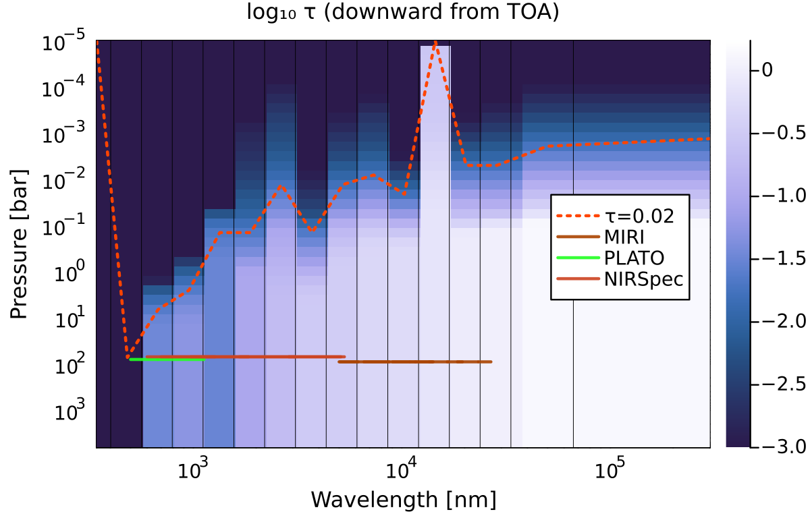
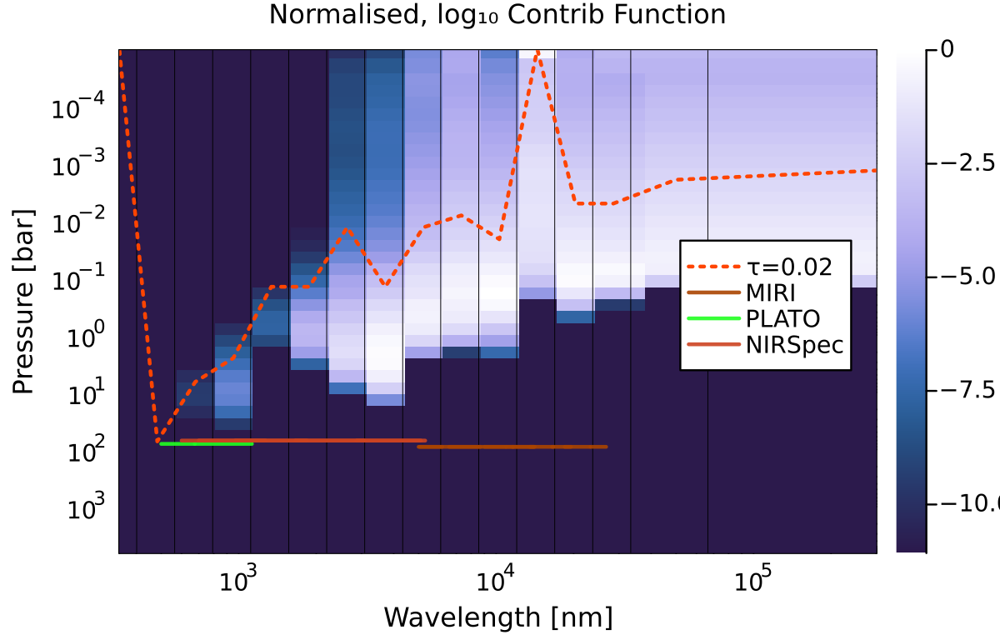

# Radiative-convective solution, CLI

## Run the model

Instead, we can model an atmosphere such that energy is globally and locally conserved. This is a state of radiative-convective equilibrium, although latent heat effects and conduction are also included.

To see this case, run the configuration used for the test suite:
```bash
./agni.jl test/test.toml
```

## Output log

The output now contains more details. Below, I have inserted inline comments to qualify the meaning of each section of the output log.

```log
# Initial setup and memory allocation.
[ INFO  ] Using configuration 'Unit tests configuration'
[ INFO  ] Setting-up a new atmosphere struct

# Load thermo data from pre-computed tables, which are stored in the res/ folder.
[ INFO  ] Loading thermodynamic data

# Sample the provided spectrum onto the correlated-k bands.
[ INFO  ] Inserting stellar spectrum, Rayleigh coefficients

# Allocate arrays for storing gas mixing ratios, etc.
[ INFO  ] Allocating atmosphere with initial composition:
[ INFO  ]       1 H2O      1.11e-01 (COND EOS_IDEAL)
[ INFO  ]       2 CO2      8.33e-01 (EOS_IDEAL)
[ INFO  ]       3 N2       5.56e-02 (EOS_IDEAL)

# Set the initial temperature profile to be isothermal.
[ INFO  ] Setting T(p): iso

# We will solve for RCE using a damped Newton Optimisation method.
# Sol_type means to solve for a particular flux_int, or equivalently, Tint.
# Here, we the configuration file specifies Tint=0 K.
[ INFO  ] Solving with 'newton'
[ INFO  ]     sol_type = 3,     conv_type = 1
[ INFO  ]     flux_int = 0.00 W m-2

# Begin iterations to solve for RCE, up to a specified tolerance.
# The 'cost' function decreases as we eventually converge upon a solution.
[ INFO  ]     step  |res_med|    cost     flux_OLR   max(x)     max(|dx|)  flags
[ INFO  ]        1  3.310e+01  1.119e+06  1.361e+04  7.010e+02  1.500e-03  Cs-M-C2-Ls
[ INFO  ]        2  2.924e+01  2.197e+05  5.778e+03  6.803e+02  1.500e+02  Cs-M-C2
[ INFO  ]        3  1.655e+01  1.315e+04  2.008e+03  6.142e+02  1.500e+02  Cs-M-C2
[ INFO  ]        4  5.056e+00  3.188e+02  7.977e+02  6.276e+02  1.027e+02  Cs-M-C2
[ INFO  ]        5  1.829e+00  1.198e+02  4.706e+02  6.302e+02  7.784e+01  Cs-M-C2
[ INFO  ]        6  3.314e-01  2.484e+01  3.845e+02  6.322e+02  7.669e+01  Cs-M-C2
[ INFO  ]        7  6.487e-02  2.404e+01  3.720e+02  6.324e+02  4.582e+01  Cs-M-C2
[ INFO  ]        8  2.006e-02  2.715e+01  3.732e+02  6.325e+02  1.430e+01  Cs-M-C2
[ INFO  ]        9  2.135e-02  1.772e+01  3.491e+02  6.327e+02  1.530e+01  Cs-M-C2
[ INFO  ]       10  3.596e-03  6.479e+00  3.517e+02  6.327e+02  4.241e+00  Cs-M-C2
[ INFO  ]       11  7.630e-04  7.853e+00  3.462e+02  6.327e+02  4.367e+00  Cs-Mr-C2-Ls
[ INFO  ]       12  2.962e-04  1.612e+00  3.446e+02  6.327e+02  1.224e+00  Cs-Mr-C2
[ INFO  ]       13  1.698e-04  4.021e+00  3.441e+02  6.327e+02  6.182e-01  Cs-Mr-C2
[ INFO  ]       14  6.885e-04  1.298e+01  3.412e+02  6.327e+02  5.994e-01  Cs-Mr-C2
[ INFO  ]       15  9.680e-04  1.078e+02  3.475e+02  6.327e+02  2.234e+00  Cs-M-C2-Ls
[ INFO  ]       16  1.489e-03  1.601e+01  3.450e+02  6.327e+02  1.832e+00  Cs-M-C2
[ INFO  ]       17  3.372e-04  1.145e+01  3.421e+02  6.327e+02  4.160e-01  Cs-M-C2
[ INFO  ]       18  2.949e-04  3.664e+01  3.440e+02  6.327e+02  1.666e+00  Cs-M-C2-Ls
[ INFO  ]       19  4.438e-04  5.535e+00  3.453e+02  6.327e+02  7.897e-01  Cs-M-C2
[ INFO  ]       20  1.765e-04  2.354e+00  3.454e+02  6.327e+02  2.167e-01  Cs-Mr-C2
[ INFO  ]       21  1.625e-04  1.381e+00  3.455e+02  6.327e+02  1.386e-01  Cs-Mr-C2
[ INFO  ]       22  1.598e-04  1.478e+00  3.454e+02  6.327e+02  2.909e-01  Cs-Mr-C2-Ls
[ INFO  ]       23  2.287e-04  1.793e+00  3.452e+02  6.327e+02  5.355e-01  Cs-Mr-C2-Ls
[ INFO  ]       24  4.640e-04  2.384e+00  3.449e+02  6.326e+02  1.002e+00  Cs-Mr-C2
[ INFO  ]       25  1.365e-03  3.780e+00  3.444e+02  6.326e+02  1.882e+00  Cs-Mr-C2
[ INFO  ]       26  2.153e-03  6.138e+00  3.432e+02  6.326e+02  3.277e+00  Cs-Mr-C2
[ INFO  ]       27  2.802e-03  5.326e+00  3.430e+02  6.326e+02  2.846e+00  Cs-Mr-C2
[ INFO  ]       28  6.560e-04  3.686e+00  3.443e+02  6.326e+02  6.242e-01  Cs-C2-Ls
[ INFO  ]       29  2.976e-04  3.962e+00  3.455e+02  6.326e+02  5.136e-01  Cs-C2-Ls
[ INFO  ]       30  6.007e-05  2.412e+00  3.456e+02  6.326e+02  1.653e-01  Cs-C2
[ INFO  ]       31  2.877e-06  3.662e-01  3.455e+02  6.326e+02  6.625e-02  Cs-C2
[ INFO  ]     success in 31 steps

# Convergence information about the final state.
# The tolerance in the configuration file means that 0.36 W/m^2 of energy is lost.
[ INFO  ]     total flux at TOA  = -1.03e-02 W m-2
[ INFO  ]     total flux at BOA  = +1.10e-06 W m-2
[ INFO  ]     global flux loss   = +3.63e-01 W m-2  (+1.21e+02 %)
[ INFO  ]     final conv.value   = +3.66e-01 W m-2
[ INFO  ]     surf temperature   = 632.616   K
[ INFO  ]     surf pressure      = 6.485e+03 bar
[ INFO  ]     done

# SOCRATES radiative transfer performance (can be disabled in config).
[ INFO  ] Radiative transfer benchmarking statistics...
[ INFO  ]     total evals: 5943 in 16.770860649 secs
[ INFO  ]     performance: 2.8219519853609287 ms/eval

# Final surface temperature is less than the dew point of steam, so the surface is super-saturated and an ocean is rained out.
[ INFO  ] Surface liquid H2O mass: 2.61e+06 kg/m^2

# Given the ocean basin geometry in the config, this corresponds to a water world.
[ INFO  ] Oceans cover 100% area, max depth 3.92292 km

# Information about the photosphere, directly related to the region probed by transit spectroscopy.
[ INFO  ] Photosphere defined at τ=0.02 and λ=1.12 μm
[ INFO  ]     pressure: 2533.53 mbar, temperature: 476.72 K
[ INFO  ]     planet radius: 1.01 R⊕, bulk density: 5.29e+03 kg/m^3

# Final information is written and plots are created (see below).
[ INFO  ] Writing results
[ INFO  ] Plotting results
[ INFO  ] Model runtime: 33.25 seconds
```

## Plots

The final temperature profile is plotted in the output folder. It shows a near-isothermal stratosphere and near-isothermal deep radiative region (since Tint=0).


Convection is parameterised using mixing length theory in this case, allowing the system
to be solved using a Newton-Raphson method. In the convective region at ~0.1 bar, we can
see that the radiative fluxes and convective fluxes entirely cancel, because AGNI was
asked to solve for a case with zero total flux transport. The MLT convection scheme also estimates the Kzz profile shown in the T(p) plot.


We can also plot the outgoing emission spectrum and normalised longwave contribution
function (CF). The spectrum clearly demonstrates complex spectral absorption features, and exceeds blackbody emission at shorter wavelengths due to Rayleigh scattering.


The optical depth as a function of pressure and wavelength can be visualised with a heatmap. This tells us how deep radiation entering into the top of the atmosphere would penetrate.



Given this atmospheric opacity and temperature profile, we can quantify how much each pressure level contributes to the outgoing emission spectrum at a given wavelength -- this is the 'contribution function'. We can also plot this versus wavelength and pressure.



## Output data

To view the output data, we can use the `ncdump` command line utility. This data could also be read by Julia and Python libraries.

```bash
ncdump -h out/atm.nc
```

From this, we get a lot of output. These include all the spectral fluxes, gas profiles, thermodynamic profiles, and metadata. The header information should look something like this:

```log
// global attributes:
:description = "AGNI atmosphere data" ;
:date = "2026-May-25 07:41:21" ;
:hostname = "your_computer_name" ;
:username = "your_username" ;
:AGNI_version = "1.11.0" ;
:SOCRATES_version = "2603.7" ;
:SOCRATES_precision = "double" ;
:name = "41a2d25b" ;
:platform = "your_operating_system" ;
```

## Read output data with Python

Julia is great, but sometimes a plot needs to be made in Python. To open the data file in Python, try the following in your Python shell. This would also work in a script.

```python
# Import the libraries
>>> import netCDF4 as nc

# Open the file
>>> ds = nc.Dataset("out/atm.nc")

# List all the keys
>>> ds.variables.keys()
dict_keys(['max_cff_p', 'tmp_surf', 'flux_int', 'instellation', 'inst_factor', ...])

# Extract data from one of the variables
>>> ds["density"][:]
masked_array(data=[2.87971515e-05, 5.06496018e-05, 8.14789325e-05,
                   1.32965455e-04, 2.14754572e-04, 3.41038597e-04,
                   5.46461700e-04, 8.94193717e-04, 1.46041473e-03,
                    ...
                   3.09340752e+02, 4.99184266e+02, 8.05552598e+02,
                   1.29995690e+03, 2.09780182e+03, 3.38532260e+03,
                   4.72606340e+03, 5.19902390e+03],
             mask=False,
       fill_value=1e+20)

# Do all your plotting here!
```
