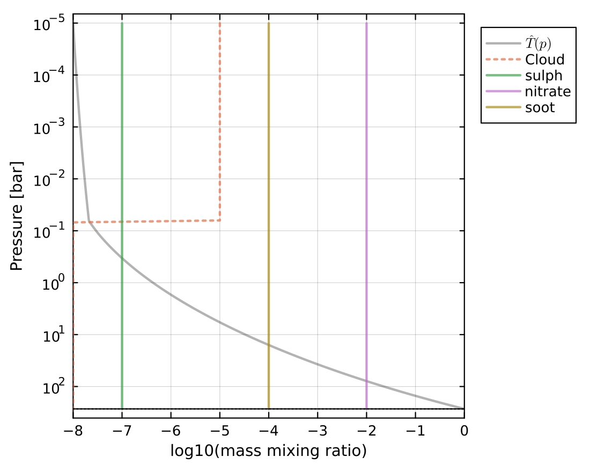
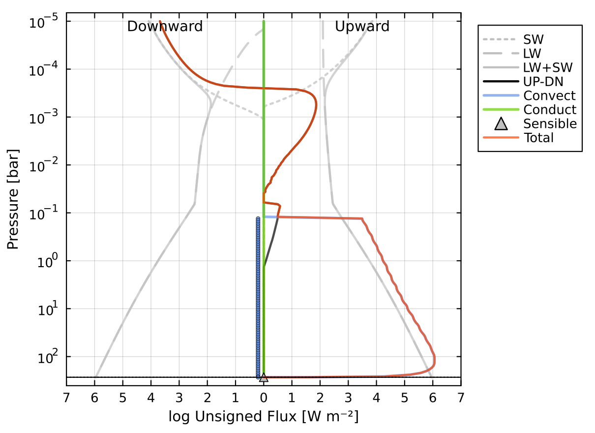
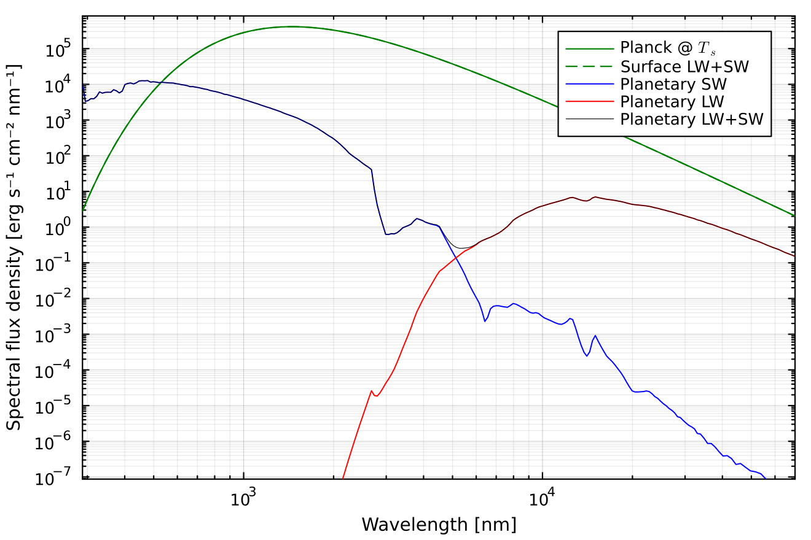
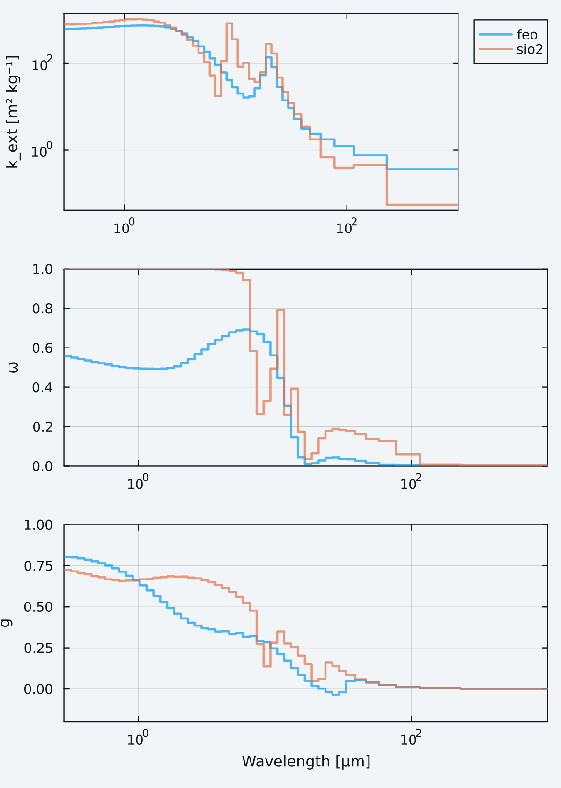

# Aerosol radiative properties, CLI

AGNI incorporates the radiative effects of aerosols and clouds in the atmosphere. Each aerosol species uses either pre-computed optical properties supplied with SOCRATES (`method = "mon"`, including soot, ash, sulphate, and nitrate particles), or optical properties calculated at runtime from refractive indices using Mie theory (`method = "mie"`). See [Aerosols and clouds](@ref) for details.

## Pre-computed aerosols

In the example below, an atmosphere is configured with three aerosol species at different concentrations. The configuration file is located at `res/config/physics/aerosols.toml`. Each aerosol is configured in its own table, for example:
```toml
[composition.aerosols.soot]
    method      = "mon"
    mmr         = 1e-4
```

Run this script in the usual manner:

```bash
./agni.jl res/config/physics/aerosols.toml
```

The plot below shows the enforced mixing ratio profiles of the aerosols. Water is plotted with a dotted line because its radiative effects are disabled in this example.



Aerosols modify both shortwave and longwave radiative transfer. The flux profiles below show how aerosols alter the vertical distribution of radiative heating and cooling. Importantly, the shortwave stellar radiation is largely reflected and attenuated at low pressures.



The emission spectrum highlights the fingerprint of the aerosols. The plot shows a distinct shortwave contribution (blue line) due to back-scattering from the aerosols specifically, with some identifiable features.



## Refractory clouds with Mie theory

Clouds of silicates and iron oxides are expected in the atmospheres of lava planets. Their optical properties can be calculated from refractive index data, which must first be downloaded:
```bash
./src/get_data.sh refractive
```

The configuration file `res/config/physics/aerosols_refractory.toml` places an amorphous silica cloud and an iron oxide (wüstite) cloud in a hot steam and CO₂ atmosphere:
```toml
[composition.aerosols.sio2]
    method      = "mie"
    mmr         = 1e-5
    nk_file     = "SiO2_amorph"
    r_eff       = 1.0e-6
    sigma_g     = 1.65
```

Run it in the usual manner:
```bash
./agni.jl res/config/physics/aerosols_refractory.toml
```

With `plots.aerosol_optics = true`, the band-averaged optical properties calculated for each aerosol are plotted. Silica scatters almost without absorption at visible wavelengths, but absorbs strongly near 9 μm and 20 μm, whereas wüstite absorbs strongly throughout the visible.



AGNI warns if the refractive index data do not cover all of the bands in the spectral file. Here, the FeO data only extend to 42 μm, so its properties at longer wavelengths are extrapolated.
