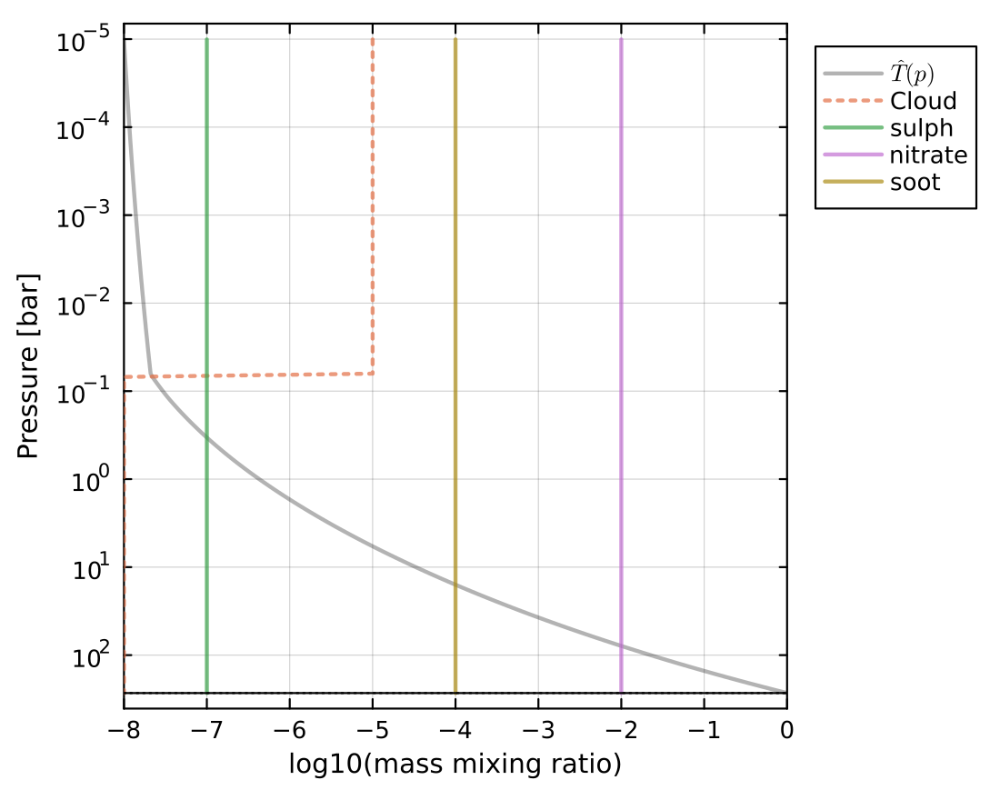
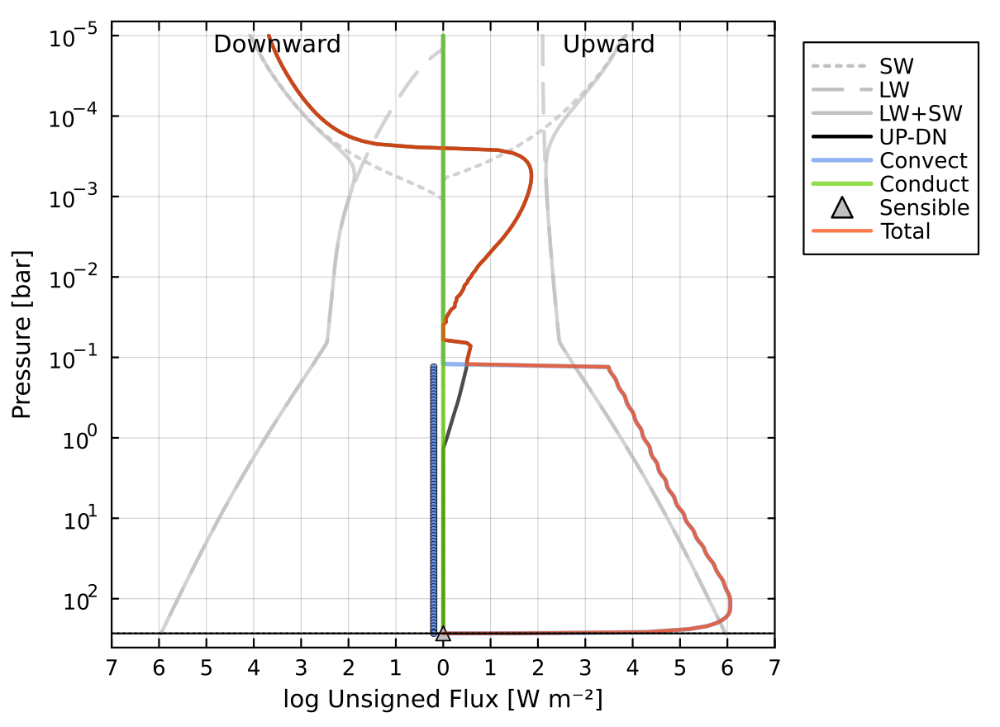
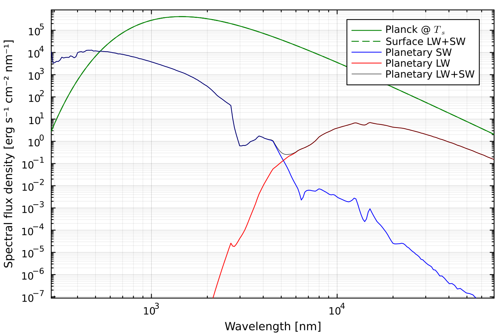

# Example outputs

These examples illustrate the kinds of results AGNI can produce. You can find
Jupyter notebooks which reproduce these results in the
[tutorials directory](https://github.com/nichollsh/AGNI/tree/main/tutorials) of
the repository.

## Pure steam runaway greenhouse effect
By assuming the atmosphere temperature profile follows a dry adiabat and the water
vapour-condensate coexistence curve defined by the Clausius-Clapeyron relation, we see a
characteristic relationship between the outgoing longwave radiation (OLR) and the surface
temperature ($T_s$). Initially OLR increases with $T_s$, but as the condensing layer
(which is independent of $T_s$) overlaps with the photosphere, OLR and $T_s$ decouple.
Eventually the atmosphere reaches a dry post-runaway state, and OLR increases rapidly
with $T_s$.

## Prescribed convective case
In this case, a temperature profile is prescribed to follow a dry adiabat from the
surface to a moist region, and then a pseudoadiabat to the top of the atmosphere. This is
in line with previous works and the OLR curve above.

Radiative fluxes are then calculated according to this temperature profile. Because the
profile is prescribed, the fluxes are not balanced locally or globally across the column.

## Radiative-convective solution
Instead, we can model an atmosphere such that energy is globally and locally conserved.
Convection is parameterised using mixing length theory in this case, allowing the system
to be solved using a Newton-Raphson method. In the convective region at ~0.1 bar, we can
see that the radiative fluxes and convective fluxes entirely cancel, because AGNI was
asked to solve for a case with zero total flux transport.

We can also plot the outgoing emission spectrum and normalised longwave contribution
function (CF). The spectrum clearly demonstrates complex water absorption features, and
exceeds blackbody emission at shorter wavelengths due to Rayleigh scattering. The CF
quantifies how much each pressure level contributes to the outgoing emission spectrum at a
given wavelength -- this is then plotted versus wavelength and pressure.

## Aerosol radiative properties
AGNI incorporates the radiative effects of aerosols and clouds in the atmosphere. The model supports arbitrary aerosol types, basedon Mie theory. Pre-computed aerosol types include soot, ash, sulfate, and nitrate particles.

In the example below, an atmosphere is configured with three aerosol species at different concentrations. The configuration file is located at `res/config/physics/aerosols.toml`

The plot below shows the enforced mixing ratio profiles of the aerosols. Water is plotted with a dotted line because its ratiative effects are disabled in this example.

Aerosols modify both shortwave and longwave radiative transfer. The flux profiles below show how aerosols alter the vertical distribution of radiative heating and cooling. Importantly, the shortwave stellar radiation is largely reflected and attenuated at low pressures.

The emission spectrum highlights the fingerprint of the aerosols. The plot shows a distinct shortwave contribution (blue line) due to back-scattering from the aerosols specifically, with some identifiable features.

